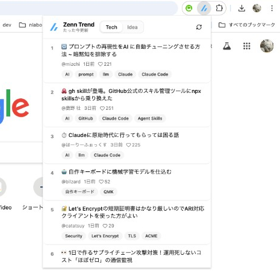
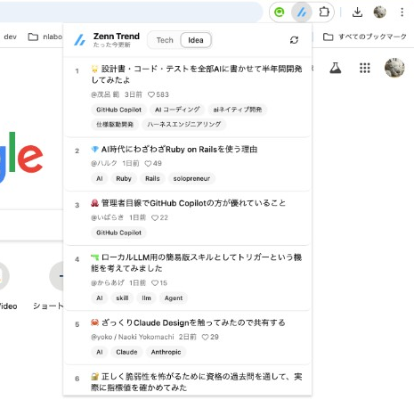

## はじめに

Zennのトレンド記事、毎日チェックしていますか？

私は日課にしているのですが、毎回ブラウザでZennのトップページを開いて確認するのが地味に面倒でした。
「ツールバーからワンクリックで見れたら楽なのに」と思い、Chrome拡張機能 **Zenn Trend Viewer** を作りました。

https://github.com/kamata-bug-factory/zenn-trend-viewer

## 何ができるか

ツールバーのアイコンをクリックするとポップアップが開き、Zennのトレンド記事 Top10 が一覧表示されます。
ヘッダーのトグルで Tech / Idea を切り替えられます。

各記事には以下の情報が表示されます。

- 記事タイトル（クリックで記事ページに遷移）
- 著者名
- 投稿日時（「〇分前」「〇時間前」などの相対時刻）
- タグ一覧
- LGTM数

| Tech を表示 | Idea に切り替え |
| :---: | :---: |
|  |  |

記事データは `chrome.storage.local` に Tech / Idea 別々のキーで3時間キャッシュされるため、トグルを行き来してもAPIリクエストが走ることはありません。

## 技術スタック

| 項目 | 技術 |
| --- | --- |
| 言語 | TypeScript（strict mode） |
| UI | React 19 + Vite |
| UIライブラリ | shadcn/ui + Tailwind CSS v4 |
| Chrome拡張 | Manifest V3 |
| ビルド | Vite + CRXJS Vite Plugin |
| CI/CD | GitHub Actions（タグ push で自動リリース） |

Chrome拡張のビルドには [CRXJS Vite Plugin](https://crxjs.dev/vite-plugin/) を使っています。
`manifest.json` を Vite の設定にそのまま渡すだけで、HMR 付きの開発環境とプロダクションビルドの両方が手に入ります。

```typescript
// vite.config.ts
import { crx } from "@crxjs/vite-plugin";
import manifest from "./public/manifest.json";

export default defineConfig({
  plugins: [react(), tailwindcss(), crx({ manifest })],
});
```

## アーキテクチャ

### ディレクトリ構成

```
src/
├── popup/           # ポップアップUI（エントリポイント）
│   ├── App.tsx
│   └── components/  # ArticleCard, CategoryToggle, Header など
├── components/      # 共有UIコンポーネント（shadcn/ui）
├── hooks/           # useArticles
├── services/        # 外部通信
│   └── api.ts       # Zenn API クライアント
├── storage/         # chrome.storage ラッパー
│   └── cache.ts     # 記事キャッシュ管理（Tech / Idea を別キー）
└── types/           # 型定義
```

### データ取得の流れ

トレンド記事のデータは2段階で取得します。

```
1. 一覧取得   : GET https://zenn.dev/api/articles?order=daily&article_type={tech|idea}
                → 記事ID, slug, タイトル, 著者名, 投稿日時, LGTM数を取得（上位10件）

2. 詳細取得   : GET https://zenn.dev/api/articles/{slug} × 10件
                → タグ一覧（topics）を補完
```

一覧エンドポイントのレスポンスには `topics`（タグ）が含まれません。
そのためタグを出すには記事ごとの詳細エンドポイントを叩く必要があり、「一覧 + 個別詳細」の2段階構成になっています。

## 実装のポイント

### 1. Tech / Idea の出し分け

Zenn API の一覧エンドポイントは Tech / Idea で別々に提供されており、表示される記事も完全に別物です。
そのため API クライアントはカテゴリを引数に取り、対応するエンドポイントから一覧を取得する作りにしました。

キャッシュも Tech / Idea で別キーに保持することで、同じ3時間のTTLのまま両カテゴリを独立して管理できるようにしています。
ヘッダーのトグル切替時は記事取得フックにカテゴリを渡し直すだけでよく、Tech / Idea それぞれのキャッシュが独立して効きます。

### 2. N+1 リクエストの抑制

タグを表示するには記事ごとに `GET /api/articles/:slug` を叩く必要があります。
素直に実装すると「一覧1回 + 記事N件分」のN+1パターンになってしまうため、表示対象を上位10件に限定しました。

さらに、10件の詳細取得は `Promise.all` で並列実行して体感速度を短縮し、取得結果を `chrome.storage.local` に3時間キャッシュすることで、ポップアップを開くたびにリクエストが走るのを防いでいます。

## リリース自動化

タグを push すると GitHub Actions が自動でビルドし、GitHub Release に zip を添付します。

```yaml
name: Release Chrome Extension

on:
  push:
    tags:
      - "v*"

permissions:
  contents: write

jobs:
  release:
    runs-on: ubuntu-latest
    steps:
      - uses: actions/checkout@v4
      - uses: actions/setup-node@v4
        with:
          node-version: 22
          cache: npm
      - run: npm ci
      - run: npm run build
      - name: Create zip
        run: cd dist && zip -r ../zenn-trend-viewer-${{ github.ref_name }}.zip .
      - name: Create GitHub Release
        uses: softprops/action-gh-release@v2
        with:
          files: zenn-trend-viewer-${{ github.ref_name }}.zip
          generate_release_notes: true
```

ユーザーは Release ページから zip をダウンロードし、Chrome の「パッケージ化されていない拡張機能を読み込む」で利用できます。

## おわりに

インストール方法や使い方はリポジトリの README を参照してください。

https://github.com/kamata-bug-factory/zenn-trend-viewer

Zenn Trend Viewer でトレンドの波に乗れ！！！
